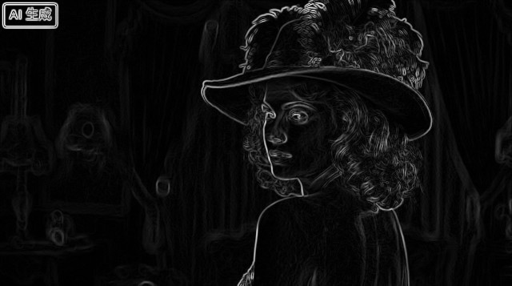
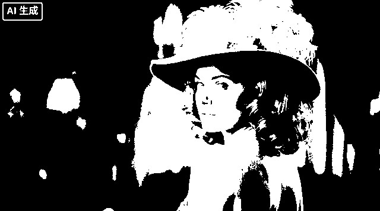
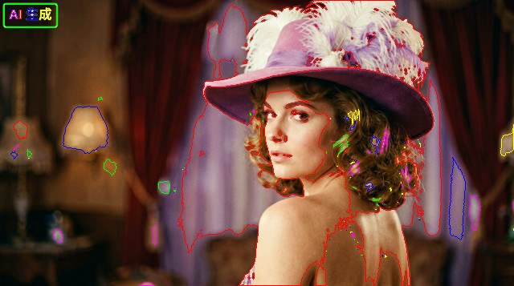

# Millow

A **zero-FFI, cross-platform image-processing library** for MoonBit. `millow`
works entirely on in-memory RGBA8 buffers (`Array[Byte]`, laid out `H × W × 4`)
and builds on every backend: `wasm-gc`, `wasm`, `js`, and `native`.

## Demo

Run `moon run cmd/main` to generate the following effects from
`docs/images/lena_ai_generated.png`:

| Input | `to_grayscale` | `tint(100,150,200)` | `gaussian_blur(σ=2)` |
|:---:|:---:|:---:|:---:|
|  |  |  |  |

| `sharpen(1.0)` | `sobel` | `equalize_histogram` | `threshold_otsu` |
|:---:|:---:|:---:|:---:|
|  |  |  |  |

| `rotate_any(45°)` | `find_contours` | `pipeline` |
|:---:|:---:|:---:|
|  |  |
  |

## Features

- **Core image type** — `Image` with construction, pixel access, cloning,
  channel split/merge, and sub-images.
- **Color** — grayscale (flat & weighted), invert, tint, BGR, alpha flatten,
  and `over` compositing.
- **Geometry** — crop, flips, 90/180/270 rotation, arbitrary rotation,
  translation, affine transform, resize (nearest / bilinear / bicubic),
  rescale, fit/cover, thumbnails, and padding.
- **Enhancement** — brightness, contrast, gamma, normalize, auto-contrast,
  sharpen, and unsharp mask.
- **Threshold & histogram** — fixed threshold, Otsu, Sauvola, histogram
  (gray & color), and equalization.
- **Filters & edges** — convolution, box/Gaussian blur, median/min/max,
  bilateral filter, Sobel, Scharr, Prewitt, Laplacian, and Canny.
- **Morphology** — erode, dilate, open, close, gradient, top-hat, black-hat.
- **Feature detection** — LBP, HOG, Harris corner detection.
- **Measurement** — connected components, find contours, moments, Hu moments,
  region properties.
- **Data augmentation** — random crop, flip, rotate, brightness/contrast/gamma
  adjustment, Gaussian/salt-pepper noise, color jitter.
- **Metrics** — MSE, PSNR, SSIM.
- **Drawing** — pixels, lines, rectangles, circles, ellipses, polygons, and
  flood fill.
- **I/O** — PPM/PGM serialization plus a pluggable `Encoder`/`Decoder` registry.

## Project layout

```
millow/
├── src/              # implementation package (megemini/millow/src)
├── millow.mbt        # root facade: re-exports the public API (megemini/millow)
├── test/             # blackbox test package exercising the public API
├── test_alignment/   # alignment tests against Python (skimage/Pillow) reference
└── cmd/main/         # runnable end-to-end demo
```

The root package is a thin **facade** over `src`, so downstream users just
`import "megemini/millow"` and reach the whole API through `@millow`.

## Installation

```
moon add megemini/millow
```

Then import it in your package's `moon.pkg`:

```
import {
  "megemini/millow" @millow,
}
```

## Quick start

```mbt nocheck
///|
test "build, transform and inspect an image" {
  // A 64×64 canvas with a filled rectangle drawn on it.
  let base = Image::from_pixel(64, 64, 30, 60, 90, 255)
  let canvas = draw_rect(base, 8, 8, 40, 40, 220, 40, 40, 255, true, 1)

  // Grayscale → blur → edges.
  let gray = to_grayscale(canvas)
  let blurred = gaussian_blur(gray, 1.5)
  let edges = sobel(blurred)
  assert_eq(edges.shape(), (64, 64))

  // Otsu adaptive threshold.
  let (_, binary) = threshold_otsu(blurred)
  assert_eq(binary.shape(), (64, 64))

  // Downscale and serialize to PPM.
  let thumb = resize(canvas, 16, 16, Nearest)
  let ppm = to_ppm(thumb)
  assert_eq(ppm[0], 'P'.to_int().to_byte())
}
```

> In the examples above the API is called unqualified because they run inside
> the `millow` package itself. From another module, prefix each name with the
> import alias, e.g. `@millow.to_grayscale(img)`.

## Augmentation pipeline

Compose multiple augmentations into a single pass with `augment_pipeline`,
which applies each `Augmentation` variant left-to-right:

```mbt nocheck
///|
test "augment_pipeline example" {
  let img = Image::from_pixel(64, 64, 30, 60, 90, 255)
  let out = augment_pipeline(img, [
    FlipHorizontal,
    Rotate(15.0),
    Brightness(1.2),
    Contrast(1.3),
    NoiseGaussian(8.0),
  ])
  assert_true(out.h > 0 && out.w > 0)
}
```

Available `Augmentation` variants: `Crop(y, x, h, w)`, `Resize(dst_h, dst_w)`,
`FlipHorizontal`, `FlipVertical`, `Rotate(angle)`, `Brightness(factor)`,
`Contrast(factor)`, `Gamma(g)`, `NoiseGaussian(std)`, `NoiseSaltPepper(prob)`,
`ColorJitter(b, c, s, h)`. `augment_pipeline` may raise on invalid crop/resize
arguments.

To sample one augmentation from a weighted distribution, use
`augment_random_choice`:

```mbt nocheck
///|
test "augment_random_choice example" {
  let img = Image::from_pixel(64, 64, 30, 60, 90, 255)
  let out = augment_random_choice(img, [
    (0.4, FlipVertical),
    (0.4, Gamma(0.8)),
    (0.2, ColorJitter(0.2, 0.2, 0.0, 0.0)),
  ])
  assert_eq(out.shape(), img.shape())
}
```

## API notes

### Brightness adjustment

`adjust_brightness(img, factor)` uses a multiplicative factor:

- `factor = 1.0` returns the original image
- `factor = 0.0` returns a black image
- Values greater than 1.0 brighten the image
- Values less than 1.0 darken the image

### Contrast adjustment

`adjust_contrast(img, factor)` adjusts contrast relative to the image's average luma:

- `factor = 1.0` returns the original image
- `factor = 0.0` returns a solid gray image equal to the image's mean
- Values greater than 1.0 increase contrast
- Values less than 1.0 decrease contrast

### Alpha compositing

`flatten_alpha(img, r, g, b)` composites the image over a solid background color, using floating-point blending for smooth results.

### Border handling

Several operations support a `mode` parameter that controls how border pixels are handled:

- `Replicate` — extends the nearest edge pixel outward
- `Reflect` — mirrors pixels across the edge
- `Wrap` — tiles the image periodically
- `Constant(r, g, b, a)` — fills border regions with a constant color

Functions supporting an optional `mode` parameter include `affine_transform` and `shear`. Most other operations use replicate (clamp) border handling internally.

### Bilateral filter

`bilateral_filter(img, d, sigma_color, sigma_space)` applies edge-preserving smoothing:

- `d` is the diameter of the pixel neighborhood (use 0 to auto-compute based on sigma_space)
- `sigma_color` controls how similar colors must be to influence each other (larger = more smoothing)
- `sigma_space` controls how close pixels must be spatially to influence each other (larger = wider neighborhood)

### Affine transform

`affine_transform(img, matrix, dst_h, dst_w, interp, mode)` applies a general affine transformation using a 6-element matrix `[a, b, c, d, e, f]` representing:

```
x' = a*x + b*y + c
y' = d*x + e*y + f
```

Use `rotate_any` and `translate` for common transformations.

### Random noise

`random_noise_gaussian(img, std)` adds Gaussian noise with the specified standard deviation.

`random_noise_salt_pepper(img, amount)` adds salt-and-pepper noise with the specified amount (fraction of pixels affected).

## Backends

`millow` contains no foreign function calls. It is verified to build on
`wasm-gc`, `wasm`, `js`, and `native`, and the test suite passes on each.

## Testing

```
moon test                 # run every test
moon test --target native # pick a backend
moon run cmd/main         # run the demo pipeline
```

### Alignment tests

`test_alignment/` verifies millow's output against a Python reference
(numpy / skimage / Pillow) that implements the same algorithms. The workflow
is:

1. `test_alignment/generate_fixtures.py` computes expected output bytes for
   small test images and writes them as `Array[Int]` literals in
   `fixtures_test.mbt`.
2. The MoonBit tests construct `Image`s from those fixtures, run each millow
   operation, and compare byte-for-byte (exact for integer ops, ±1 tolerance
   for floating-point rounding).

Regenerate the fixtures after changing an algorithm:

```
source /home/shun/venv310/bin/activate
python test_alignment/generate_fixtures.py
moon test
```

## License

Apache-2.0. See [LICENSE](LICENSE).